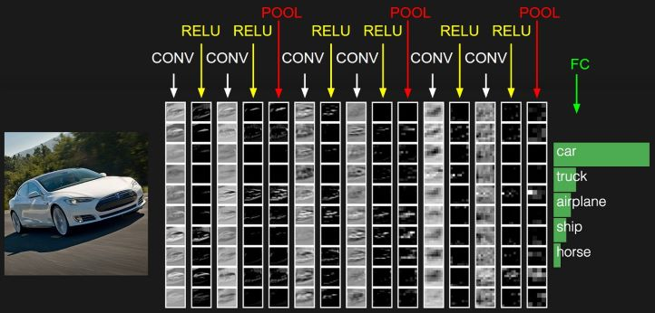
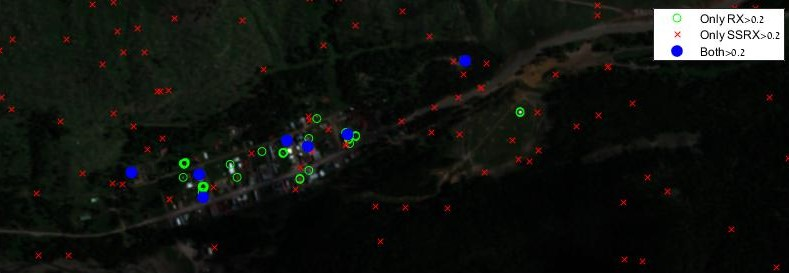

# Doronser's Projects Portfolio

## [CS231n Convolutional Neural Networks for Visual Recognition Assignment Solutions](https://github.com/doronser/CS231n)
Solutions to the 2020 version of the course. Contains all 3 notebooks

## Hyperspectral Image Processing
### [Intro to HSI](https://github.com/doronser/Debbi-s-Cube)
This repo contains a step-by-step guide for Hyperspectal Target Detection using MATLAB.

### [Comparing RX and SSRX Algorithms](https://github.com/doronser/SSRX_project)
The repository contains part of my project for the course:
Selected Topics in Images Processing, [Prof. Stanley Rotman](http://www.ee.bgu.ac.il/~srotman/)

The goal of this project is to compare two anomaly detection algorithms for hyperspectral images – the RX algorithm and its subspace projection variation known as the SSRX algorithm. While these two algorithms are mathematically and logically similar, the different results achieved when applying them on real data are interesting to research.

In order to further examine the effects of subspace projection, it was also tested in the task of change detection using the Chronochrome algorithm.

